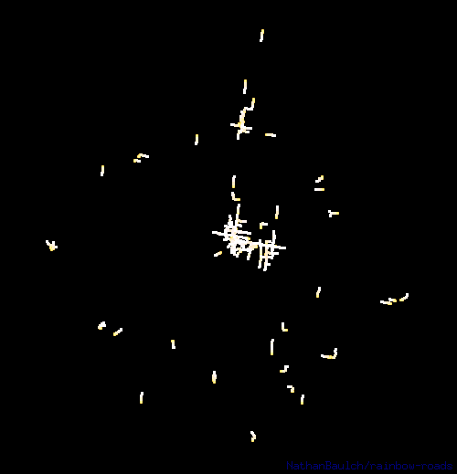

A command line tool that animates your exercise maps, inspired by an [article by Andriy Yaremenko](https://medium.com/geospatial-analytics/how-to-animate-strava-gpx-tracks-in-qgis-8a8ca6b58ebc).



## Features
* Supports FIT, TCX, GPX files. It can also traverse into ZIP files for easy ingestion of bulk activity exports.
* Outputs GIF, animated PNG, or a ZIP file containing each frame in JPEG format.
* Activities can be filtered by sport, date, distance, duration and geographic region.
* Configurable color scheme.

## Example usage
```text
> rainbow-roads \
    -sport running \
    -after 2020-08-01 \
    -min_duration 15m \
    -min_distance 3km \
    -bounded_by -37.8,144.9,5km \
    -output lockdown_project \
    path/to/my/activity/data
```
Some basic statistics are output to help validate the activities that were included and to aid in further refining filters.
```text
activity files: 9,327
 100% |████████████████████████████████████████| [3s:0s]            
activities:     270
period:         1.6 year(s) (2020-08-02 to 2022-02-24)
duration range: 15m28s to 1h32m39s
distance range: 3.0km to 16.8km
bounds:         -37.8,144.9,4987.12259
total points:   154,907
total duration: 197h58m26s
total distance: 2,110.7km
```
The easiest way to find the coordinates of a known location is to right-click on it in Google Maps and select the first menu item.

## Options
```text
Usage of rainbow-roads:
  -after date
        date from which activities should be included
  -before date
        date prior to which activities should be included
  -bounded_by region
        region that activities must be fully contained within, eg -37.8,144.9,10km
  -colors string
        CSS linear-colors inspired color scheme string, eg red,yellow@10%,green@20%,blue (default #fff,#ff8@0.01,#911@0.03,#414@0.07,#007@0.15,#001)
  -ends_near region
        region that activities must end in, eg 30.06,31.22,1km
  -format string
        output file format string, supports gif, png, zip
  -frames uint
        number of animation frames (default 100)
  -max_distance distance
        greatest distance of included activities, eg 10mi
  -max_duration duration
        longest duration of included activities, eg 1h
  -min_distance distance
        shortest distance of included activities, eg 2km
  -min_duration duration
        shortest duration of included activities, eg 15m
  -output string
        optional path of the generated file (default "out")
  -passes_through region
        region that activities must pass through, eg 40.69,-74.12,10mi
  -sport value
        sports to include, can be specified multiple times, eg running, cycling
  -starts_near region
        region that activities must start from, eg 51.53,-0.21,1km
  -width uint
        width of the generated image in pixels (default 500)
```

## Garmin tutorial
1. Request a copy of all your activity data here: https://www.garmin.com/en-US/account/datamanagement/exportdata/
2. Download the file linked in the email they send.
3. Specify filter options to refine the activities included.
4. Pass the downloaded ZIP file path to rainbow-roads after any options. 

## Installing from source
Simply install Go and run:
```
go install github.com/NathanBaulch/rainbow-roads
```

## Built with
* [lucasb-eyer/go-colorful](https://github.com/lucasb-eyer/go-colorful) - color gradient interpolation
* [schollz/progressbar](https://github.com/schollz/progressbar) - CLI progress bar
* [tormoder/fit](https://github.com/tormoder/fit) - FIT file support
* [llehouerou/go-tcx](https://github.com/llehouerou/go-tcx) - TCX file support
* [tkrajina/gpxgo](https://github.com/tkrajina/gpxgo) - GPX file support
* [kettek/apng](https://github.com/kettek/apng) - animated PNG file support
* [araddon/dateparse](https://github.com/araddon/dateparse) - permissive date parsing
* [bcicen/go-units](https://github.com/bcicen/go-units) - distance unit conversion
* [StephaneBunel/bresenham](https://github.com/StephaneBunel/bresenham) - GPX distance calculation

## Future work
* Improve rendering with smoother anti-aliasing
* Provide option to strip time gaps in activities (pauses)
* Support generating WebM files
* Configurable dot size
* Performance improvements
* Localization