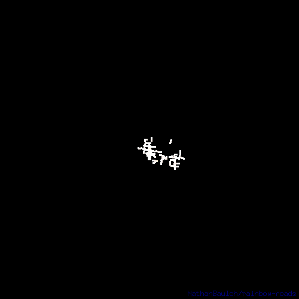
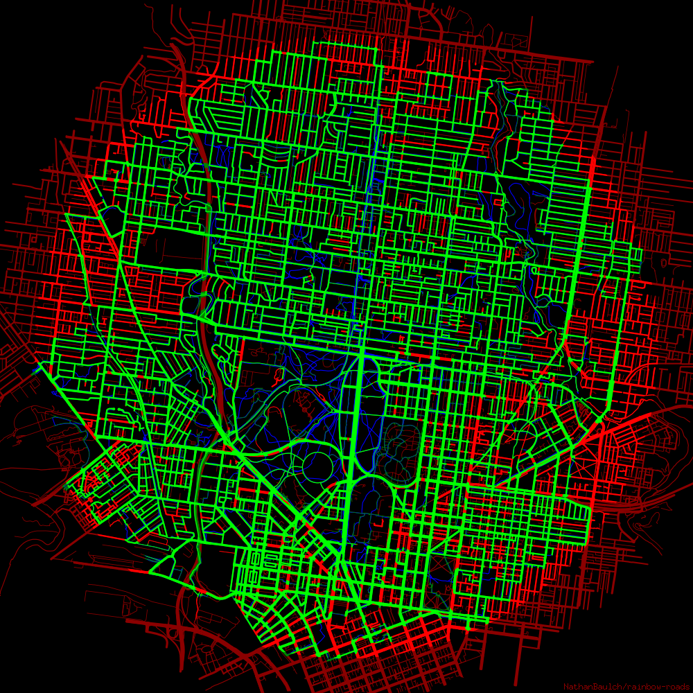

A command line tool that animates your exercise maps, inspired by an [article by Andriy Yaremenko](https://medium.com/geospatial-analytics/how-to-animate-strava-gpx-tracks-in-qgis-8a8ca6b58ebc).



## Features
* Supports FIT, TCX, GPX files. It can also traverse into ZIP files for easy ingestion of bulk activity exports.
* Outputs GIF, animated PNG, or a ZIP file containing each frame in GIF format.
* Activities can be filtered by sport, date, distance, duration and geographic region.
* Configurable color scheme.

## Example usage
```text
> rainbow-roads \
    --sport running \
    --after 2020-08-01 \
    --min_duration 15m \
    --min_distance 3km \
    --max_pace 10m/km \
    --bounded_by -37.8,144.9,5km \
    --output lockdown_worms \
    path/to/my/activity/data
```
Some basic statistics are output to help validate the activities that were included and to aid in further refining filters.
```text
files:         55,536
activities:    272
records:       196,092
sports:        running (272)
period:        6.7 years (2017-04-08 to 2023-12-21)
duration:      26m23s to 1h49m52s, average 1h0m6s, total 272h27m32s
distance:      6.0km to 18.0km, average 10.6km, total 2,876.5km
pace:          4m13s/km to 7m54s/km, average 5m40s/km
bounds:        -37.8,144.9,4041.90923
starts within: -37.8,144.9,585.60073
ends within:   -37.8,144.9,3934.96018
```
The easiest way to find the coordinates of a known location is to right-click on it in Google Maps and select the first menu item.

## Options
```text
Usage:
  rainbow-roads [flags] [input]

General flags:
  -o, --output string   optional path of the generated file (default "out")
  -f, --format string   output file format string, supports gif, png, zip (default "gif")

Filtering flags:
      --sport sports            sports to include, can be specified multiple times, eg running, cycling
      --after date              date from which activities should be included
      --before date             date prior to which activities should be included
      --min_duration duration   shortest duration of included activities, eg 15m
      --max_duration duration   longest duration of included activities, eg 1h
      --min_distance distance   shortest distance of included activities, eg 2km
      --max_distance distance   greatest distance of included activities, eg 10mi
      --min_pace pace           slowest pace of included activities, eg 8km/h
      --max_pace pace           fastest pace of included activities, eg 10min/mi
      --bounded_by circle       region that activities must be fully contained within, eg -37.8,144.9,10km
      --starts_near circle      region that activities must start from, eg 51.53,-0.21,1km
      --ends_near circle        region that activities must end in, eg 30.06,31.22,1km
      --passes_through circle   region that activities must pass through, eg 40.69,-74.12,10mi

Rendering flags:
      --frames uint        number of animation frames (default 200)
      --fps uint           animation frame rate (default 20)
  -w, --width uint         width of the generated image in pixels (default 500)
      --colors colors      CSS linear-colors inspired color scheme string, eg red,yellow,green,blue,black (default #fff,#ff8@0.125,#911@0.25,#414@0.375,#007@0.5,#003)
      --color_depth uint   number of bits per color in the image palette (default 5)
      --speed float        how quickly activities should progress (default 1.25)
      --loop               start each activity sequentially and animate continuously
      --no_watermark       suppress the embedded project name and version string
```

## Beginners guide (Windows)
1. Download the latest release of rainbow-roads and extract the ZIP archive into the same directory.
   * _Advanced:_ Move the rainbow-roads.exe to a more permanent location in your path.
2. Request a copy of your activity data.
   * **Garmin:** Follow the "Export All Garmin Data Using Account Management Center" directions in [this](https://support.garmin.com/en-AU/?faq=W1TvTPW8JZ6LfJSfK512Q8) support article.
   * **Strava:** Follow the "Bulk Export" directions in [this](https://support.strava.com/hc/en-us/articles/216918437-Exporting-your-Data-and-Bulk-Export#Bulk) support article.
3. Download the ZIP file linked in the email they send. No need to extract it.
4. Open the standard Command Prompt app.
5. Run `cd %HOMEPATH%\Downloads` to change into the downloads directory.
6. Run `rainbow-roads export.zip` where export.zip is the name of the activity ZIP file you were emailed.
   * _Advanced:_ Specify filter options to refine the activities included (see example usage above).
7. Open "out.gif" in a browser and enjoy the show.

## Installing from source
Simply install Go and run:
```
go install github.com/NathanBaulch/rainbow-roads@latest
```

## Paint
A sub-command used to track street coverage, useful for #everystreet style challenges and to make animations more spectacular.



## Features
* Streets are painted green by running within a 25 meters threshold of them.
* OpenStreetMap road data is automatically downloaded as needed, excluding alleyways, footpaths, trails and roads under construction.
* A progress percentage is calculated by the ratio of green to red pixels.
* Supports all the same activity filter options described above.

## Built with
* [lucasb-eyer/go-colorful](https://github.com/lucasb-eyer/go-colorful) - color gradient interpolation
* [tormoder/fit](https://github.com/tormoder/fit) - FIT file support
* [llehouerou/go-tcx](https://github.com/llehouerou/go-tcx) - TCX file support
* [tkrajina/gpxgo](https://github.com/tkrajina/gpxgo) - GPX file support
* [kettek/apng](https://github.com/kettek/apng) - animated PNG file support
* [araddon/dateparse](https://github.com/araddon/dateparse) - permissive date parsing
* [bcicen/go-units](https://github.com/bcicen/go-units) - distance unit conversion
* [serjvanilla/go-overpass](https://github.com/serjvanilla/go-overpass) - OpenStreetMap client
* [expr-lang/expr](https://github.com/expr-lang/expr) - expression language
* [fogleman/gg](https://github.com/fogleman/gg) - 2D floating point renderer
* [spf13/cobra](https://github.com/spf13/cobra) - CLI framework

## Future work
* Improve rendering with smoother antialiasing
* Provide option to strip time gaps in activities (pauses)
* Support generating WebM files
* Configurable dot size
* Performance improvements
* Localization
