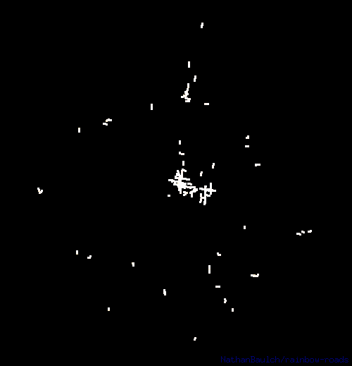

A command line tool that animates your exercise maps, inspired by an [article by Andriy Yaremenko](https://medium.com/geospatial-analytics/how-to-animate-strava-gpx-tracks-in-qgis-8a8ca6b58ebc).



## Features
* Supports FIT, TCX, GPX files. It can also traverse into ZIP files for easy ingestion of bulk activity exports.
* Outputs GIF, animated PNG, or a ZIP file containing each frame in GIF format.
* Activities can be filtered by sport, date, distance, duration and geographic region.
* Configurable color scheme.

## Example usage
```text
> rainbow-roads \
    -sport running \
    -after 2020-08-01 \
    -min_duration 15m \
    -min_distance 3km \
    -max_pace 10m/km \
    -bounded_by -37.8,144.9,5km \
    -output lockdown_project \
    path/to/my/activity/data
```
Some basic statistics are output to help validate the activities that were included and to aid in further refining filters.
```text
activity files: 9,327
 100% |████████████████████████████████████████| [3s:0s]            
activities:     268
sports:         running (268)
period:         1.6 years (2020-08-02 to 2022-02-24)
duration range: 16m1s to 1h38m27s
distance range: 3.0km to 16.8km
pace range:     4m25s/km to 9m21s/km
bounds:         -37.8,144.9,4987.12259
total points:   154,326
total duration: 206h20m19s
total distance: 2,102.2km
average pace:   5m53s/km
```
The easiest way to find the coordinates of a known location is to right-click on it in Google Maps and select the first menu item.

## Options
```text
Usage of rainbow-roads:
  -format string
        output file format string, supports gif, png, zip
  -output string
        optional path of the generated file (default "out")
Filtering:
  -after date
        date from which activities should be included
  -before date
        date prior to which activities should be included
  -bounded_by region
        region that activities must be fully contained within, eg -37.8,144.9,10km
  -ends_near region
        region that activities must end in, eg 30.06,31.22,1km
  -max_distance distance
        greatest distance of included activities, eg 10mi
  -max_duration duration
        longest duration of included activities, eg 1h
  -max_pace pace
        fastest pace of included activities, eg 10min/mi
  -min_distance distance
        shortest distance of included activities, eg 2km
  -min_duration duration
        shortest duration of included activities, eg 15m
  -min_pace pace
        slowest pace of included activities, eg 8km/h
  -passes_through region
        region that activities must pass through, eg 40.69,-74.12,10mi
  -sport value
        sports to include, can be specified multiple times, eg running, cycling
  -starts_near region
        region that activities must start from, eg 51.53,-0.21,1km
Rendering:
  -color_depth uint
        number of bits per color in the image palette (default 5)
  -colors string
        CSS linear-colors inspired color scheme string, eg red,yellow,green,blue,black (default #fff,#ff8,#911,#414,#007@.5,#003)
  -fps uint
        animation frame rate (default 20)
  -frames uint
        number of animation frames (default 200)
  -loop
        start each activity sequentially and animate continuously
  -no_watermark
        suppress the embedded project name and version string
  -speed float
        how quickly activities should progress (default 1.25)
  -width uint
        width of the generated image in pixels (default 500)
```

## Beginners guide (Windows)
1. Download the latest release of rainbow-roads and extract the ZIP archive into the same directory.
   * _Advanced:_ Move the rainbow-roads.exe to a more permanent location in your path.
2. Request a copy of your activity data.
   * **Garmin:** Follow the "Export All Garmin Data Using Account Management Center" directions in [this](https://support.strava.com/hc/en-us/articles/216918437-Exporting-your-Data-and-Bulk-Export#Bulk) support article.
   * **Strava:** Follow the "Bulk Export" directions in [this](https://support.strava.com/hc/en-us/articles/216918437-Exporting-your-Data-and-Bulk-Export#Bulk) support article.
3. Download the ZIP file linked in the email they send. No need to extract it.
4. Open the standard Command Prompt app.
5. Run `cd %HOMEPATH%\Downloads` to change into the downloads directory.
6. Run `rainbow-roads export.zip` where export.zip is the name of the activity ZIP file you were emailed.
   * _Advanced:_ Specify filter options to refine the activities included (see example usage above).
7. Open "out.gif" in a browser and enjoy the show.

## Installing from source
Simply install Go and run:
```
go install github.com/NathanBaulch/rainbow-roads@latest
```

## Built with
* [lucasb-eyer/go-colorful](https://github.com/lucasb-eyer/go-colorful) - color gradient interpolation
* [schollz/progressbar](https://github.com/schollz/progressbar) - CLI progress bar
* [tormoder/fit](https://github.com/tormoder/fit) - FIT file support
* [llehouerou/go-tcx](https://github.com/llehouerou/go-tcx) - TCX file support
* [tkrajina/gpxgo](https://github.com/tkrajina/gpxgo) - GPX file support
* [kettek/apng](https://github.com/kettek/apng) - animated PNG file support
* [araddon/dateparse](https://github.com/araddon/dateparse) - permissive date parsing
* [bcicen/go-units](https://github.com/bcicen/go-units) - distance unit conversion
* [StephaneBunel/bresenham](https://github.com/StephaneBunel/bresenham) - GPX distance calculation

## Future work
* Improve rendering with smoother anti-aliasing
* Provide option to strip time gaps in activities (pauses)
* Support generating WebM files
* Configurable dot size
* Performance improvements
* Localization